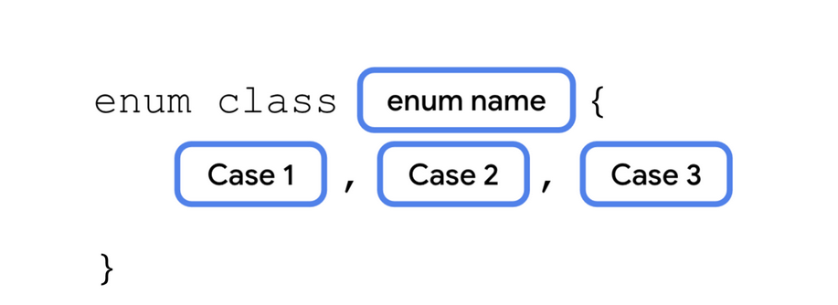

# Apredizaje modulo 3

## Clase genérica
```kotlin

//Problema crear 3 clases con iguales parametros solucion añadir una clase general 
class FillInTheBlankQuestion(
    val questionText: String,
    val answer: String,
    val difficulty: String
)
class TrueOrFalseQuestion(
    val questionText: String,
    val answer: Boolean,
    val difficulty: String
)
class NumericQuestion(
    val questionText: String,
    val answer: Int,
    val diff:String
 )

class Question<T>(
    val questionText: String,
    val answer: T,
    val difficulty: String
    
    )

fun main() {
    val question1 = Question<String>("Quoth the raven ___", "nevermore", "medium")
    val question2 = Question<Boolean>("The sky is green. True or false", false, "easy")
    val question3 = Question<Int>("How many days are there between full moons?", 28, "hard")
}
```

## Clase ENUM

Una clase enum se usa para crear tipos con un conjunto limitado de valores posibles.A cada valor posible de una enum se lo conoce como una constante enum. 
Las constantes de enumeración se colocan dentro de las llaves separadas por comas. Se usa mayúscula en todas las letras del nombre de la constante.

Se debe hacer referencia a las constantes enum usando el operador de punto.

<br>


<br>


```kotlin

enum class Difficulty {
    EASY, MEDIUM, HARD
}
class Question<T>(
    val questionText: String,
    val answer: T,
    val difficulty: Difficulty
)
val question1 = Question<String>("Quoth the raven ___", "nevermore", Difficulty.MEDIUM)
val question2 = Question<Boolean>("The sky is green. True or false", false, Difficulty.EASY)
val question3 = Question<Int>("How many days are there between full moons?", 28, Difficulty.HARD)

```

## Clase de datos
Cuando una clase se define como una clase de datos, se implementan los siguientes métodos:
1. equals()
2.  hashCode() (verás este método cuando trabajes con ciertos tipos de colecciones)
3.   toString()
4.  componentN(): component1(), component2(), etc.
5.  5.  copy()
Nota importante
Una clase de datos debe tener al menos un parámetro en su constructor, y todos los parámetros del constructor deben estar marcados con val o var.
Una clase de datos tampoco puede ser abstract, open, sealed ni inner.

```kotlin

enum class Difficulty {
    EASY, MEDIUM, HARD
}
data class Question<T>(
    val questionText: String,
    val answer: T,
    val difficulty: Difficulty
)

val question1 = Question<String>("Quoth the raven ___", "nevermore", Difficulty.MEDIUM)
val question2 = Question<Boolean>("The sky is green. True or false", false, Difficulty.EASY)
val question3 = Question<Int>("How many days are there between full moons?", 28, Difficulty.HARD)

```

Aquí tienes un resumen de la lección sobre **cómo usar un objeto singleton** en Kotlin:

## 🧐 El Patrón Singleton

El patrón **Singleton** asegura que una clase solo pueda tener **una única instancia** a lo largo de toda la aplicación. Esto es útil en situaciones donde múltiples instancias serían innecesarias o problemáticas, como:

  * Gestión de estadísticas de un juego (ej. progreso del jugador actual).
  * Control de un único recurso de hardware (ej. altavoz).
  * Acceso a una fuente de datos o servicio de autenticación.

-----

## 🛠️ Cómo Definir un Objeto Singleton en Kotlin

Kotlin simplifica la creación de un singleton utilizando la palabra clave `object`.

  * En lugar de usar `class`, se usa `object`.
  * Un **objeto singleton** no puede tener un constructor, ya que no se puede instanciar directamente.
  * Todas sus propiedades y funciones se definen entre llaves `{}`.

**Ejemplo de Singleton:**

```kotlin
object StudentProgress {
    // Propiedades accesibles directamente
    var total: Int = 10
    var answered: Int = 3 
    // ... y se pueden añadir funciones
}
```

-----

## 🙋 Cómo Acceder a un Objeto Singleton

Debido a que solo existe una instancia, se accede a sus propiedades y métodos **directamente usando el nombre del objeto**, seguido del operador de punto (`.`).

**Ejemplo de Acceso:**

```kotlin
fun main() {
    // Acceso directo al objeto y sus propiedades
    println("${StudentProgress.answered} of ${StudentProgress.total} answered.") 
    // Salida: 3 of 10 answered.
}
```

-----

## 🤝 Objetos Complementarios (`companion object`)

Puedes definir un objeto singleton dentro de una clase, marcándolo como un **objeto complementario** usando la palabra clave `companion`.

  * Se define un `companion object` **dentro de una clase**.
  * Esto permite acceder a sus propiedades y métodos **utilizando solo el nombre de la clase** que lo contiene, lo que resulta en una sintaxis más concisa.

**Ejemplo de Objeto Complementario:**

```kotlin
class Quiz {
    // ... otras propiedades de la clase Quiz

    companion object StudentProgress { // Definición como objeto complementario
        var total: Int = 10
        var answered: Int = 3
    }
}
```

**Acceso con Objeto Complementario:**

Aunque las propiedades están en el `companion object StudentProgress`, se accede a ellas a través del nombre de la clase `Quiz`:

```kotlin
fun main() {
    // Acceso usando el nombre de la clase Quiz
    println("${Quiz.answered} of ${Quiz.total} answered.") 
    // Salida: 3 of 10 answered.
}
```

Aquí tienes un resumen de la lección sobre **cómo extender clases con propiedades y métodos nuevos** en Kotlin.

## 💡 Concepto Principal: Extensiones en Kotlin

Kotlin permite **extender clases existentes** (incluso clases de la biblioteca estándar o de terceros) añadiendo nuevas **propiedades** y **funciones** sin tener que modificar el código fuente original de esa clase ni heredar de ella.

Esto se logra utilizando la sintaxis de **extensión**, que hace que el nuevo miembro parezca y se sienta como si fuera parte de la clase original, lo que mejora la legibilidad del código.

-----

## ➕ 1. Cómo Agregar una Propiedad de Extensión

Una **propiedad de extensión** te permite añadir una propiedad de **solo acceso** (`val`) a una clase existente.

### Sintaxis

Para definirla, se usa el nombre de la clase que se quiere extender (el **tipo receptor**), seguido de un punto (`.`), y luego el nombre de la nueva propiedad:

```kotlin
val NombreDeClase.nombreDePropiedad: TipoDeDato
    get() = // Lógica para calcular el valor
```

### Ejemplo

Se extiende el objeto complementario `Quiz.StudentProgress` con una propiedad `progressText`:

```kotlin
// Extiende el objeto complementario de la clase Quiz
val Quiz.StudentProgress.progressText: String 
    // Debe tener un getter, no puede almacenar datos
    get() = "${answered} of ${total} answered" 
```

### Uso

Dado que extiende un `companion object`, se accede a ella usando el nombre de la clase principal:

```kotlin
fun main() {
    println(Quiz.progressText) // Imprime: 3 of 10 answered
}
```

> **Nota Importante:** Las propiedades de extensión **no pueden almacenar datos**. Deben ser de solo lectura (`val`) y siempre requieren un método `get()` para calcular y devolver un valor.

-----

## 🛠️ 2. Cómo Agregar una Función de Extensión

Una **función de extensión** te permite añadir un nuevo método a una clase existente.

### Sintaxis

Al igual que con las propiedades, se usa el nombre de la clase a extender, seguido de un punto (`.`), y luego la definición de la función:

```kotlin
fun NombreDeClase.nombreDeFuncion(parametro: Tipo): TipoDeRetorno {
    // Cuerpo de la función
}
```

### Ejemplo

Se añade la función `printProgressBar()` al objeto `Quiz.StudentProgress`:

```kotlin
fun Quiz.StudentProgress.printProgressBar() {
    // El cuerpo de la función puede acceder a las propiedades internas
    repeat(answered) { print("▓") }
    repeat(total - answered) { print("▒") }
    println()
    println(progressText) // Se puede llamar a otras extensiones
}
```

### Uso

Se llama a la función como si fuera un método regular de la clase:

```kotlin
fun main() {
    Quiz.printProgressBar() 
    /* Imprime:
    ▓▓▓▒▒▒▒▒▒▒
    3 of 10 answered
    */
}
```

-----

## 📝 Beneficio Principal

El uso de propiedades y métodos de extensión hace que tu código sea **más legible** y **más idiomático**. Permite a los desarrolladores exponer funcionalidades útiles en un formato de **sintaxis de punto** (`.`) que es familiar y fácil de usar, como se ve con frecuencia en bibliotecas como Jetpack Compose (`10.dp`, `2.0.sp`).

Aquí tienes un resumen de la lección sobre **cómo reescribir las funciones de extensión con interfaces** en Kotlin.

## 📝 El Problema de la Extensión y la Solución de la Interfaz

Mientras que las **funciones de extensión** son geniales para añadir funcionalidad a clases existentes a las que no tienes acceso (o para casos de uso específicos), no son la mejor solución cuando:

1.  Tienes acceso al **código fuente** de la clase.
2.  Necesitas que **varias clases** compartan un **conjunto común** de propiedades y métodos (con posible comportamiento diferente).
3.  Solo te importa **que un método o propiedad exista**, no cómo se implementa inicialmente.

La solución es usar una **interfaz**.

-----

## 🏗️ ¿Qué es una Interfaz?

Una **interfaz** es un **contrato** que define un conjunto de propiedades y métodos que una clase debe implementar.

  * Se define con la palabra clave `interface`.
  * Solo especifica las **firmas** (la "forma") de las propiedades (de solo lectura) y los métodos, sin proporcionar la implementación del código.

### Sintaxis de la Interfaz

```kotlin
interface ProgressPrintable {
    // Propiedad de solo lectura (la clase debe implementarla)
    val progressText: String 

    // Firma de la función (la clase debe implementarla)
    fun printProgressBar() 
}
```

-----

## 🤝 Implementación de una Interfaz por una Clase

Una clase **extiende** (o se ajusta a) una interfaz declarándola después del nombre de la clase con dos puntos (`:`).

### 1\. Extender el Contrato

La clase `Quiz` acepta el contrato `ProgressPrintable`:

```kotlin
class Quiz : ProgressPrintable { 
    // ... Contenido de la clase
}
```

### 2\. Implementar Miembros con `override`

La clase debe **implementar obligatoriamente** todos los miembros definidos en la interfaz usando la palabra clave `override`:

| Miembro de la Interfaz | Implementación en la Clase `Quiz` |
| :--- | :--- |
| `val progressText: String` | `override val progressText: String get() = "${answered} of ${total} answered"` |
| `fun printProgressBar()` | `override fun printProgressBar() { /* Código de la barra de progreso */ }` |

Esto asegura que **cualquier clase** que implemente `ProgressPrintable` tendrá las propiedades y métodos `progressText` y `printProgressBar()`.

-----

## 🎯 Ventajas Clave de Usar Interfaces

Al reescribir la funcionalidad de extensión con una interfaz, el código se vuelve:

  * **Más Modular y Coherente:** El compilador garantiza que todas las clases que extienden la interfaz tengan exactamente la misma firma de método/propiedad.
  * **Reutilizable:** Puedes añadir clases de `Survey` o `Recipe` (que no tienen relación con `Quiz`) y hacer que implementen la misma interfaz `ProgressPrintable`, reutilizando el concepto de "barra de progreso".
  * **Flexible (Polimorfismo):** Se pueden intercambiar diferentes implementaciones de clases (ej. una clase real y una clase *mock* para pruebas) siempre y cuando cumplan el mismo contrato de interfaz.

**Uso en `main()` (Requiere Instancia):**

Dado que `printProgressBar()` ahora es un **método de instancia** de la clase `Quiz` (ya no es una función de extensión estática del `companion object`), se necesita crear un objeto `Quiz` para llamarlo:

```kotlin
fun main() {
    Quiz().printProgressBar() 
    /* Salida:
    ▓▓▓▒▒▒▒▒▒▒
    3 of 10 answered.
    */
}
```

-----

Aquí tienes un resumen conciso de la lección sobre **cómo usar funciones de alcance para acceder a las propiedades y los métodos de la clase** en Kotlin.

## 🗂️ Funciones de Alcance (Scope Functions)

Las **funciones de alcance** son funciones de orden superior en Kotlin que permiten acceder de forma concisa a las propiedades y métodos de un objeto (el **objeto receptor**) dentro de un bloque de código (lambda), evitando la necesidad de repetir el nombre de la variable.

El cuerpo de la lambda "toma el alcance" del objeto con el que se llama. Esto hace que el código sea más **legible** y **conciso**.

-----

## 1\. Función `let()`: Referencia Implícita con `it`

La función `let()` permite referenciar el objeto receptor dentro de la expresión lambda usando el identificador **`it`**, en lugar del nombre real del objeto.

  * **Sintaxis:** Se llama como una función de extensión en cualquier objeto (`objeto.let { ... }`).
  * **Propósito:** Es útil para realizar una o más operaciones sobre un objeto sin repetir un nombre de variable largo o para encadenar llamadas.

### Ejemplo de Uso con `let()`

En lugar de repetir `question1`:

```kotlin
// Código original (repetitivo)
println(question1.questionText)
println(question1.answer)

// Usando let() para usar 'it'
question1.let {
    println(it.questionText) // 'it' se refiere a question1
    println(it.answer)
}
```

-----

## 2\. Función `apply()`: Configuración de Objetos

La función `apply()` es una función de extensión que se usa principalmente para **configurar propiedades** de un objeto inmediatamente después de su creación.

  * **Sintaxis:** Se llama en el objeto (`objeto.apply { ... }`).
  * **Objeto Receptor:** Dentro de la lambda, se accede a las propiedades y métodos del objeto directamente (sin `it` o un nombre de variable), ya que el objeto se convierte en el **receptor (`this`)** implícito.
  * **Valor de Retorno:** `apply()` **devuelve el propio objeto receptor**, lo que permite asignarlo a una variable después de configurarlo, o simplemente omitir la variable si solo se necesita para la configuración inicial.

### Ejemplo de Uso con `apply()`

Permite llamar a métodos o propiedades sin asignar el objeto a una variable primero:

```kotlin
// Antes de apply(), se necesita una variable
// val quiz = Quiz()
// quiz.printQuiz() 

// Usando apply() (llama a printQuiz() sin usar la variable 'quiz')
Quiz().apply {
    // Aquí, 'this' (implícito) es el objeto Quiz recién creado
    printQuiz() // Es equivalente a this.printQuiz()
}
```

-----

## 🔑 Resumen de Funciones de Alcance

Las funciones de alcance te permiten escribir código más **idiomático** y **limpio** al eliminar referencias de objetos repetitivas. Aunque existen otras funciones de alcance (`run`, `with`, `also`), **`let()`** y **`apply()`** son dos de las más comunes para tareas de inspección/transformación (`let`) y configuración/inicialización (`apply`).

Aquí tienes un resumen conciso de la lección sobre **Arrays en Kotlin**.

## 📦 ¿Qué es un Array?

Un **Array** (o matriz) es la forma más simple de **agrupar una secuencia de valores** que son del **mismo tipo de datos** (llamados elementos u objetos).

-----

## 📌 Características Clave de los Arrays

| Característica | Descripción |
| :--- | :--- |
| **Indexación Cero** | Los elementos se ordenan y se accede a ellos mediante un **índice**. El primer elemento está en el índice **0**, el segundo en el índice **1**, y así sucesivamente. |
| **Acceso Aleatorio** | El tiempo para acceder a cualquier elemento por su índice es **constante** y rápido, porque los elementos se almacenan contiguamente en la memoria. |
| **Tamaño Fijo** | Una vez declarado, el array tiene un **tamaño fijo**. No puedes añadir o quitar elementos para que el array sea más grande o pequeño de lo que se definió inicialmente. Intentar acceder a un índice fuera del rango causa una excepción (`ArrayIndexOutOfBoundsException`). |

-----

## 🛠️ Declaración y Acceso en Kotlin

### 1\. Declaración

Se usa la función `arrayOf()` para crear un array, pasando los elementos como parámetros. Kotlin puede **inferir el tipo** de los elementos.

```kotlin
// Declaración explícita (el tipo String es opcional)
val rockPlanets = arrayOf<String>("Mercury", "Venus", "Earth", "Mars")

// Declaración con inferencia de tipo
val gasPlanets = arrayOf("Jupiter", "Saturn", "Uranus", "Neptune")
```

### 2\. Concatenación

Puedes usar el operador **más (`+`)** para combinar dos arrays en uno **nuevo**.

```kotlin
val solarSystem = rockPlanets + gasPlanets // Crea un nuevo array de 8 elementos
```

### 3\. Acceso y Modificación

Se utiliza la **sintaxis de subíndice** (corchetes `[]`) para acceder o modificar un elemento en un índice específico.

```kotlin
// Acceder a un elemento:
println(solarSystem[0]) // Imprime: Mercury

// Modificar un elemento:
solarSystem[3] = "Little Earth" // Cambia el valor del índice 3 (el cuarto elemento)
```

-----

## ⚠️ Limitación del Tamaño Fijo

La limitación más importante de los arrays es su **tamaño fijo**. Si necesitas una colección más grande, debes crear un **array completamente nuevo**.

```kotlin
// Este array tiene 8 elementos (índices 0 a 7)
// solarSystem[8] = "Pluto" // ¡ERROR! ArrayIndexOutOfBoundsException

// Para añadir un elemento, se debe crear un array nuevo de 9 elementos
val newSolarSystem = arrayOf("Mercury", "Venus", "Earth", "Mars", "Jupiter", "Saturn", "Uranus", "Neptune", "Pluto") 
```

-----

## ⏭️ ¿Qué Sigue?

Debido a que los arrays tienen un tamaño fijo y son rígidos para tareas comunes como agregar o quitar elementos, Kotlin (y la mayoría de los lenguajes) ofrecen tipos de colecciones más flexibles. Aprenderás sobre ellos a continuación: **`List`**, **`Set`** y **`Map`**.

¡Claro\! Aquí tienes un resumen conciso de la lección sobre **Listas** en Kotlin.

-----

## 📚 Resumen de la Lección: Listas en Kotlin

### 1\. Concepto de Lista

  * Una **Lista** es una colección **ordenada** y **redimensionable**, generalmente implementada como un *array* que puede cambiar de tamaño.
  * Cuando un array subyacente se llena, se copia automáticamente a un nuevo array más grande.
  * Permite acceder a elementos por **índice** (empezando en 0), y también insertar/quitar elementos en cualquier posición.

### 2\. Interfaces Clave: `List` y `MutableList`

Las colecciones en Kotlin implementan interfaces que definen su comportamiento:

| Interfaz | Descripción | Funcionalidad |
| :--- | :--- | :--- |
| **`List`** | Define una colección **ordenada de solo lectura**. | Acceso, tamaño, búsqueda. **No permite** modificar elementos. |
| **`MutableList`** | Extiende `List` y añade métodos para **modificar** la lista. | Añadir, quitar y actualizar elementos. |

-----

### 3\. Creación y Propiedades Básicas

  * **Creación:**
      * `val listaSoloLectura = listOf(...)` -\> Crea una **`List`** (inmutable).
      * `val listaModificable = mutableListOf(...)` -\> Crea una **`MutableList`**.
  * **Tamaño:** La propiedad `.size` devuelve la cantidad de elementos.

-----

### 4\. Acceso y Búsqueda de Elementos

| Acción | Método/Sintaxis | Descripción |
| :--- | :--- | :--- |
| **Acceso por Índice** | `solarSystem[2]` o `solarSystem.get(2)` | Devuelve el elemento en el índice 2 ("Earth"). |
| **Buscar Índice** | `solarSystem.indexOf("Earth")` | Devuelve el índice del primer elemento coincidente (2). Devuelve **-1** si no lo encuentra. |
| **Verificar Existencia** | `solarSystem.contains("Pluto")` o `"Pluto" in solarSystem` | Devuelve un **`Boolean`** (`true` o `false`). |

-----

### 5\. Iteración (Bucle `for`)

Puedes recorrer todos los elementos de una lista utilizando un **bucle `for`**:

```kotlin
for (planet in solarSystem) {
    println(planet) // El código se ejecuta para cada elemento.
}
```

-----

### 6\. Modificación de `MutableList`

Para modificar una lista (añadir, quitar o actualizar), debes usar **`mutableListOf()`**:

  * **Añadir Elementos:**
      * `lista.add("Nuevo")`: Añade el elemento al **final** de la lista.
      * `lista.add(3, "Theia")`: **Inserta** el elemento en el índice 3.
  * **Actualizar Elementos:**
      * `lista[3] = "Future Moon"`: Reemplaza el elemento en el índice 3.
  * **Quitar Elementos:**
      * `lista.removeAt(9)`: Quita el elemento en el **índice** 9.
      * `lista.remove("Future Moon")`: Quita la **primera ocurrencia** del elemento con ese valor.

-----

¡Claro\! Aquí tienes un resumen de la lección sobre **Conjuntos (Sets) en Kotlin** y su funcionamiento interno.

## 📚 Resumen de la Lección: Conjuntos en Kotlin

Los conjuntos son un tipo de **colección** que garantiza que **no haya elementos duplicados** y que **no tiene un orden específico** (a diferencia de las listas).

-----

### 🔑 El Secreto de la Unicidad y la Velocidad: El Código Hash

La capacidad de un conjunto para garantizar la unicidad y realizar búsquedas rápidas se basa en el **código hash**:

  * **Código Hash:** Es un valor de tipo `Int` producido por el método `hashCode()` de cualquier objeto Kotlin. Actúa como un **identificador semiúnico** del objeto.
  * **Colisiones de Hash:** Es posible que dos objetos diferentes tengan el mismo código hash (una "colisión"), pero la función `hashCode()` está diseñada para minimizar esto, manteniendo un alto grado de exclusividad.

### ⚙️ Estructura Interna del Conjunto (Hash Set)

Un `Set` se implementa típicamente usando una estructura similar a una **tabla hash** (o un "array de listas"):

1.  **Índices (Buckets):** El array externo utiliza un **rango limitado de códigos hash** como índices (o "buckets").
2.  **Listas Internas (Chaining):** Cada índice del array apunta a una **lista interna** (generalmente una lista enlazada). Los elementos del conjunto que tienen el mismo código hash (o cuyos códigos hash mapean al mismo índice) se almacenan en la misma lista interna.
3.  **Eficiencia:** Dado que las colisiones son raras, estas listas internas suelen ser muy cortas (uno o dos elementos), lo que hace que la búsqueda sea extremadamente rápida.

-----

### ✅ Propiedades Clave de los Conjuntos

| Propiedad | Descripción |
| :--- | :--- |
| **Garantía de Unicidad** | Un conjunto **nunca** contendrá dos elementos iguales. Intentar agregar un duplicado simplemente será ignorado. |
| **Búsqueda Rápida** | La búsqueda de un elemento (`contains()`) es muy rápida, incluso en colecciones grandes. Esto se debe a que el conjunto va directamente al **índice del código hash** y solo necesita verificar unos pocos elementos en la lista interna (a diferencia de una `List`, que podría tener que recorrer todos los elementos). |
| **Uso de Memoria** | Generalmente, un conjunto usa **más memoria** que una lista con la misma cantidad de datos debido a la sobrecarga de los índices y las estructuras internas necesarias para la tabla hash. |

-----

### 🛠️ Uso de `MutableSet` en Kotlin

En Kotlin, se utilizan `Set` (inmutable) y `MutableSet` (modificable).

  * **Creación:** Se usa `mutableSetOf(...)`.
    ```kotlin
    val setPlanetas = mutableSetOf("Tierra", "Marte")
    ```
  * **Añadir Elementos:** Se usa el método `add(elemento)`. Si el elemento ya existe, el conjunto lo ignora.
    ```kotlin
    setPlanetas.add("Plutón") // Añade
    setPlanetas.add("Tierra") // Ignora (ya existe)
    ```
  * **Eliminar Elementos:** Se usa el método `remove(elemento)`. No se puede eliminar por índice, ya que los conjuntos no tienen orden.
    ```kotlin
    setPlanetas.remove("Plutón")
    ```
  * **Verificar Existencia:** Se usa `contains(elemento)` o el operador `in`.
    ```kotlin
    println("Tierra" in setPlanetas) // true
    ```

El principal beneficio de los conjuntos es su **eficiencia** para **garantizar y verificar la existencia de elementos únicos** en grandes cantidades de datos.

-----

¡Claro\! Aquí tienes un resumen de la lección sobre **Mapas (Maps) en Kotlin**.

## 🗺️ Resumen de la Lección: Mapas en Kotlin

Un **Map** (Mapa) es una colección que almacena datos en pares de **clave-valor** (**key-value pairs**). Se les llama mapas porque cada **clave** única se "mapea" a un **valor**.

-----

### 🔑 Propiedades Clave de los Mapas

  * **Claves Únicas:** Cada clave en un mapa **debe ser única**. No puedes tener dos entradas con la misma clave.
  * **Valores No Únicos:** Los **valores** no necesitan ser únicos; varias claves diferentes pueden apuntar al mismo valor (ejemplo: "Mercury" a 0, "Venus" a 0).
  * **Acceso Rápido:** Acceder a un valor usando su clave es generalmente **más rápido** que buscar un elemento en una lista grande (similar a la eficiencia de búsqueda en los Sets).

-----

### 🛠️ Declaración y Uso Básico en Kotlin

Los mapas se declaran usando `mapOf()` para mapas inmutables o `mutableMapOf()` para mapas que se pueden modificar. Requieren especificar dos tipos genéricos: uno para la clave y otro para el valor.

1.  **Declaración con Valores Iniciales:** Se usa el operador `to` para definir los pares clave-valor iniciales.
    ```kotlin
    val solarSystem = mutableMapOf(
        "Earth" to 1,
        "Mars" to 2
    )
    ```
2.  **Propiedad `size`:** Devuelve el número de pares clave-valor en el mapa.
    ```kotlin
    println(solarSystem.size) // Imprime 2
    ```

-----

### 🔄 Modificación y Acceso a Elementos

Los mapas mutables (`MutableMap`) permiten agregar, modificar y eliminar pares clave-valor:

| Operación | Sintaxis | Descripción |
| :--- | :--- | :--- |
| **Agregar/Modificar** | `mapa[clave] = valor` | Si la **clave** existe, se **modifica** su valor. Si la clave no existe, se **agrega** un nuevo par. |
| **Acceder a Valor** | `mapa[clave]` o `mapa.get(clave)` | Devuelve el **valor** asociado a la clave. Si la clave no existe, devuelve **`null`**. |
| **Eliminar** | `mapa.remove(clave)` | **Elimina** el par clave-valor con la clave especificada y devuelve el valor que se eliminó (o `null` si la clave no existía). |

**Ejemplo de Acceso y Modificación:**

```kotlin
// Agregar nuevo par:
solarSystem["Pluto"] = 5

// Acceder a valor:
println(solarSystem["Pluto"]) // Imprime: 5

```

¡Excelente! Has tocado algunas de las funciones de colección más poderosas y comunes en Kotlin (y en la programación funcional en general).

Aquí tienes un resumen conciso de cada una de ellas, junto con su propósito principal.

## 🛠️ Resumen de Funciones de Colección en Kotlin

---

### 1. `forEach`

* **Propósito:** **Iterar** sobre cada elemento de una colección para realizar una **acción** o un **efecto secundario** (como imprimir o actualizar una variable externa).
* **Retorno:** No devuelve una nueva colección (retorna `Unit`).
* **Analogía:** Recorrer una lista de tareas pendientes para simplemente **marcar** cada una como completada.

| Código de Ejemplo |
| :--- |
| `list.forEach { println(it) }` |

---

### 2. `map` (Mapeo)

* **Propósito:** **Transformar** cada elemento de una colección de un tipo a otro, o modificar su valor, y devolver una nueva colección con los resultados.
* **Retorno:** Una nueva colección del **mismo tamaño** que la original, pero con los elementos transformados.
* **Analogía:** Tomar una lista de precios y **calcular** el precio final después de impuestos para cada artículo.

| Código de Ejemplo |
| :--- |
| `val largos = list.map { it.length }` |
| `val doblados = numbers.map { it * 2 }` |

---

### 3. `filter` (Filtrado)

* **Propósito:** **Seleccionar** un subconjunto de elementos de una colección basándose en una condición (un predicado).
* **Retorno:** Una nueva colección que contiene solo los elementos que **cumplieron** la condición. El tamaño es generalmente **menor** o igual al original.
* **Analogía:** Revisar una lista de contactos para **seleccionar** solo aquellos cuyo número de teléfono comienza con "555".

| Código de Ejemplo |
| :--- |
| `val mayoresDeEdad = people.filter { it.age >= 18 }` |

---

### 4. `groupBy` (Agrupación)

* **Propósito:** **Organizar** los elementos de una colección en un **Map** (Mapa), donde la clave del mapa se determina por una función, y el valor es una **Lista** de todos los elementos que compartieron esa clave.
* **Retorno:** Un **Map** de `K` a `List<T>`, donde `K` es el tipo de la clave de agrupación y `T` es el tipo de los elementos originales.
* **Analogía:** Clasificar a todos los estudiantes de una escuela en diferentes cubetas según su **grado** ("1º", "2º", "3º").

| Código de Ejemplo |
| :--- |
| `val porEstado = users.groupBy { it.state }` |

---

### 5. `fold` (Plegado / Reducción)

* **Propósito:** **Combinar** todos los elementos de una colección en un **solo valor** acumulado. Requiere un **valor inicial** (el acumulador) y una operación que combina el acumulador actual con cada elemento de la lista.
* **Retorno:** Un **único valor** (puede ser del mismo tipo que los elementos, o un tipo completamente diferente).
* **Analogía:** Sumar todos los números de una lista, empezando por un valor inicial de $0. El acumulador es la suma actual.

| Código de Ejemplo |
| :--- |
| `val suma = numbers.fold(0) { acc, next -> acc + next }` |
| *(`acc` es el acumulador, `next` es el elemento actual)* |

---

### 6. `sortedBy` (Ordenación)

* **Propósito:** **Ordenar** los elementos de una colección basándose en el valor de una **propiedad específica** o en una función aplicada a cada elemento.
* **Retorno:** Una **nueva lista** con los elementos de la colección original ordenados de **forma ascendente** por el valor de la propiedad seleccionada.
* **Analogía:** Ordenar una lista de empleados según su **apellido** o su **salario**.

| Código de Ejemplo |
| :--- |
| `val ordenadoPorEdad = people.sortedBy { it.age }` |

---

Estas funciones son la columna vertebral del trabajo con colecciones en Kotlin, permitiendo código más **conciso, legible y expresivo**.

// Modificar valor existente:

```kotlin
solarSystem["Jupiter"] = 78
```
---
## Mejoras

## Resumen del Codificado "Woof" y Temas de Material ✨

El codelab "Woof" se centra en aplicar **Temas de Material (Material Theming)** en una aplicación de Android para mostrar una lista de perros, mejorando su atractivo visual y experiencia de usuario.

El Temas de Material se define por tres pilares que se configuran en el archivo **`Theme.kt`**:

1.  **Color**
2.  **Tipografía**
3.  **Forma (Shapes)**

---

### Componente Clave: `WoofTheme()`

El elemento componible principal que gestiona el tema es **`WoofTheme()`**.

* **Lógica de Temas Oscuros/Claros:** Determina si se debe aplicar el tema oscuro o claro basándose en la configuración del sistema (`isSystemInDarkTheme()`).
* **Color Dinámico (Android 12+):** Incluye lógica para usar el **color dinámico** (`dynamicDarkColorScheme` o `dynamicLightColorScheme`) disponible en Android 12 (API nivel 31) y superior, que extrae colores del fondo de pantalla del usuario.
* **Aplicación del Tema:** Finalmente, envuelve el contenido de la aplicación en el elemento componible **`MaterialTheme`**, donde se establecen los valores definitivos de:
    * `colorScheme` (ya sea dinámico, oscuro o claro predefinido)
    * `shapes`
    * `typography`

---

### Configuración de Pantalla Completa (Edge-to-Edge)

El tema también incluye una función `setUpEdgeToEdge` (activada por un `SideEffect`) para lograr un diseño de pantalla completa (*edge-to-edge*). Esto implica:

* Hacer que el contenido se extienda detrás de la barra de estado y la barra de navegación.
* Establecer la barra de estado con un color **transparente**.
* Configurar los colores de los iconos del sistema (barras de estado y navegación) para que sean claros u oscuros dependiendo de si el tema oscuro está habilitado.

---

### Aplicación del Tema

* **En `MainActivity.kt`**: La función `WoofTheme()` se envuelve alrededor de todo el contenido de la aplicación (`WoofApp()`) dentro de `setContent`, asegurando que el tema se aplique globalmente.
* **En `WoofPreview()`**: `WoofTheme(darkTheme = false)` también se usa para garantizar que la vista previa del componente se renderice con el sistema de Temas de Material aplicado.

En resumen, este codelab ilustra cómo usar el **sistema de Temas de Material en Jetpack Compose** para crear experiencias visuales coherentes y adaptables a diferentes configuraciones de usuario (temas claros/oscuros, versiones de Android).

## TalkBack
## Resumen del Uso de TalkBack en la App Woof 🗣️

Esta sección te introduce a **TalkBack**, el lector de pantalla de Google, y su importancia para la **accesibilidad**, especialmente para usuarios con visión reducida.

### 📝 Puntos Clave:

1.  **¿Qué es TalkBack?**
    * Un lector de pantalla que proporciona **comentarios por voz** para que los usuarios puedan navegar por la interfaz sin verla.
2.  **Modo de Uso de TalkBack:**
    * Una vez activado, la navegación cambia:
        * **Tocar** un elemento lo **selecciona** (el sistema anuncia el elemento).
        * **Tocar dos veces** el elemento seleccionado lo **activa** (hace clic).
        * Se requieren **dos dedos** para **desplazarse** o navegar por el sistema.
3.  **Propósito en el Desarrollo:**
    * Usar TalkBack en la app Woof es una excelente manera de **probar áreas de mejora** en la accesibilidad de la aplicación.
4.  **Consideraciones Técnicas:**
    * Se advierte que el audio de TalkBack en el emulador puede ser de baja calidad o bajo volumen, y se recomienda subir el volumen del emulador.

### 🛑 Cómo Desactivar TalkBack:

Se proporcionan los pasos para desactivar TalkBack una vez finalizada la prueba, ya que cambia fundamentalmente la interacción con el dispositivo:

1.  Abrir **Configuración** en el dispositivo o emulador.
2.  Ir a **Accesibilidad**, luego **TalkBack**.
3.  Desactivar la opción **Usar TalkBack**.
4.  Seleccionar **Aceptar**.

En resumen, la sección te guía para **configurar y usar TalkBack** para auditar y mejorar la accesibilidad de la aplicación Woof antes de continuar con el codelab.
