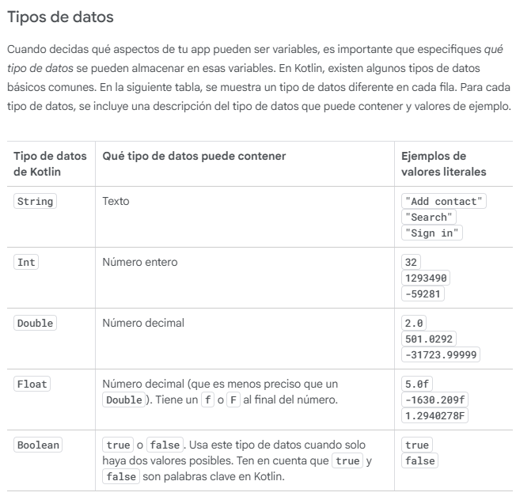
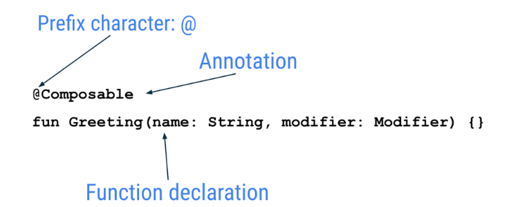
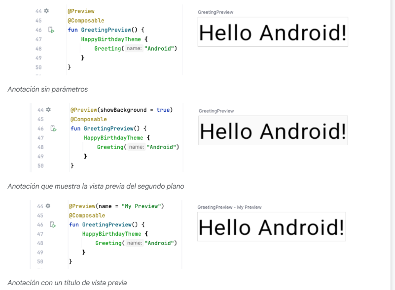
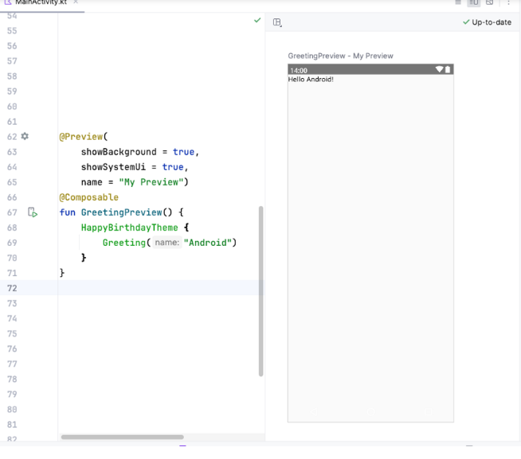
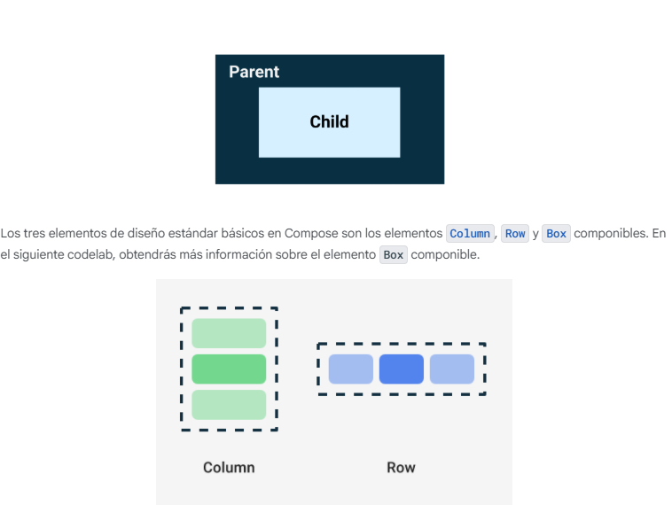
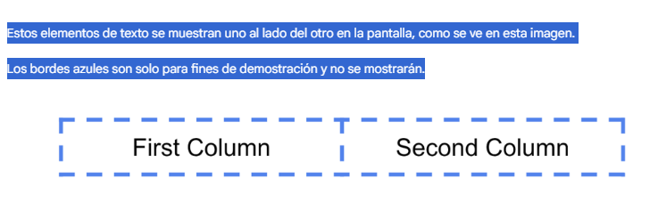
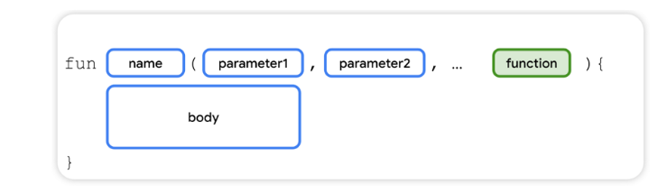

# Android Studio y Kotlin
# Propietaria
Andrea Santana López
## Kotlin playground
https://play.kotlinlang.org/
## Bases de Programación y Comienzos de Kotlin
Un programa como una serie de instrucciones para que una computadora o un dispositivo móvil realicen una acción, como mostrar un mensaje a un usuario o calcular el costo de los artículos en un carrito de compras. Las instrucciones paso a paso para lo que la computadora debe hacer se llama código.Para escribir y editar tu código, debes usar una herramienta llamada editor de código para los codelabs se usará un editor de código interactivo llamado Playground de Kotlin
El primer programa que todo informático hace es imprimir "Hola mundo" por lo que primero que veré es como realizar un "Hola Mundo" en Kotlin.
```
fun main() {
    println("Hello, world!!!")
}
```
Aquí tenemos una función llamada main que utiliza el comando println para mostrar el mensaje en la consola de comandos "CMD" en windows CLI en Linux/Mac.
## ¿Qué es Kotlin?
Podemos decir que kotlin es un lenguaje compilado ya que necesita un compilador
## Recomendaciones de estilo de Kotlin
A continuación, se incluyen algunas de las recomendaciones de la guía de estilo para lo que aprendiste en Kotlin hasta el momento:

Los nombres de las funciones deben seguir la convención de mayúsculas mediales y deben ser verbos o frases verbales.
Cada sentencia debe estar en su propia línea.
La llave de apertura debe aparecer al final de la línea donde comienza la función.
Debe haber un espacio antes de la llave de apertura.
El cuerpo de la función debe tener una sangría de 4 espacios. No uses caracteres de tabulación para aplicar sangría al código. Escribe 4 espacios.
La llave de cierre se encuentra en su propia línea después de la última línea de código del cuerpo de la función. La llave de cierre debe alinearse con la palabra clave fun al comienzo de la función.

## Variables
En la programación informática, existe el concepto de variable, que es un contenedor para un único dato. Puedes visualizarla como una caja que contiene un valor. Esa caja tiene una etiqueta, que es el nombre de la variable. Si te refieres a la caja por su nombre, tendrás acceso al valor que contiene.
### Tipos de variables

Existe también un tipo llamado null

### ¿Cómo defines una variable?
Cuando defines una variable, le asignas un nombre para identificarla de manera única. También debes decidir qué tipo de datos puede contener mediante la especificación del tipo de datos. Por último, puedes proporcionar un valor inicial que se almacenará en la variable, pero es opcional.
### Declaración de una variable como ejemplo
```
val count: Int = 2
```

Para declarar variables anulables se le pone al tipo un interrogante al lado por ejemplo --> var favoriteActor: String? = "Sandra Oh"
## ¿Cómo se comenta?
Utlizando dos barras diagonales (//) como comentario simple y /**/ como comentario de más de una línea
## ¿Qué es una función?
Una función es un segmento del programa que realiza una tarea específica. Tu programa podría tener una o más funciones.
Estas son las partes clave necesarias para definir una función:
                                                                1. La función necesita un nombre para que puedas llamarla más tarde.
                                                                2. También puede requerir algunas entradas o información que se debe proporcionar cuando se la llama. 
                                                                   La función usa estas entradas para lograr su propósito. Pedir entradas es opcional, y algunas funciones no las piden.
                                                                3. La función también tiene un cuerpo que contiene las instrucciones para realizar la tarea.

## Ejercicios del tutorial de kotlin de funciones y convenciones de estilo
1. [Ejercicios Kotlin](./CodelabTutorialKotlin/EjerciciosKotlin.kt)
2. [Conceptos básicos Kotlin](./CodelabTutorialKotlin/ConceptosBasicos.kt)

## ¿Qué es jetpackCompose?
Jetpack Compose es un kit de herramientas moderno para crear IUs de Android. Compose simplifica y acelera el desarrollo de IUs en Android con menos código, herramientas potentes y capacidades intuitivas de Kotlin. Con Compose, puedes compilar tu IU a partir de la definición de un conjunto de funciones, llamadas funciones de componibilidad, que toman datos y describen elementos de la IU.
Funciones de componibilidad
Las funciones de componibilidad son los componentes básicos de una IU en Compose. Una función de componibilidad cumple con lo siguiente:

1. Describe alguna parte de tu IU.
2. No devuelve nada.
3. Toma información y genera lo que se muestra en la pantalla.

### Anotaciones
Las anotaciones son una forma de adjuntar información adicional al código. Esta información ayuda a herramientas como el compilador de Jetpack Compose y a otros desarrolladores a comprender el código de la app.
Para aplicar una anotación, se agrega un prefijo al nombre (la anotación) con el carácter @ al comienzo de la declaración en la que se hará la anotación. Se pueden anotar diferentes elementos de código, incluidas propiedades, funciones y clases. Más adelante en el curso, aprenderás sobre las clases.

Ejemplo siguiente
```
// Example code, do not copy it over
@Json
val imgSrcUrl: String
@Volatile
private var INSTANCE: AppDatabase? = null
```
Las anotaciones pueden tomar parámetros. Proporcionan información adicional a las herramientas que las procesan. Los siguientes son algunos ejemplos de la anotación @Preview con y sin parámetros.

<br>
Ejemplo de anotaciones con parametros
<br>


## Funciones de componibilidad
La función de componibilidad tiene la anotación @Composable. Todas estas funciones deben tener esta anotación. La anotación informa al compilador de Compose que esta función está diseñada para convertir datos en IU. Te recordamos que un compilador es un programa especial que toma el código que escribiste, lo analiza línea por línea y lo traduce a algo que la computadora puede comprender (lenguaje automático).Este fragmento de código es un ejemplo de una función simple de componibilidad a la que le pasan datos (el parámetro de la función name) y los usa para renderizar un elemento de texto en la pantalla.
```
@Composable
fun Greeting(name: String) {
    Text(text = "Hello $name!")
}
```
Algunas notas sobre las funciones de componibilidad:

Jetpack Compose se basa en funciones de componibilidad. Estas funciones te permiten definir la IU de tu app de manera programática describiendo cómo debería verse, en lugar de enfocarse en el proceso de construcción de la IU. Para crear una función de componibilidad, agrega la anotación @Composable al nombre de la función.

Estas funciones pueden aceptar parámetros, que permiten que la lógica de la app describa o modifique la IU. En este caso, tu elemento de la IU acepta una String para que pueda saludar al usuario por su nombre.

La función de Compose que no devuelve nada y lleva la anotación @Composable DEBE tener un nombre con letra mayúscula inicial (pascal case). Esta es una convención de nomenclatura según la cual la primera letra de cada palabra de una palabra compuesta lleva mayúsculas. La diferencia entre este formato y el de mayúsculas mediales (camel case) es que, en el primer caso, todas las palabras se escriben con mayúscula inicial. En el segundo caso, la primera palabra puede estar en cualquiera de las dos opciones.
La función de Compose tiene las siguientes características:
DEBE ser un sustantivo: DoneButton().
NO debe ser un verbo ni una frase verbal: DrawTextField().
NO debe ser una preposición convertida en sustantivo: TextFieldWithLink().
NO debe ser un adjetivo: Bright().
NO debe ser un adverbio: Outside().
Los sustantivos PUEDEN estar precedidos por adjetivos descriptivos: RoundIcon().
<br>
Ejemplo de funciones componibles

```
// Do: This function is a descriptive PascalCased noun as a visual UI element
@Composable
fun FancyButton(text: String) {}


// Do: This function is a descriptive PascalCased noun as a non-visual element
// with presence in the composition
@Composable
fun BackButtonHandler() {}


// Don't: This function is a noun but is not PascalCased!
@Composable
fun fancyButton(text: String) {}


// Don't: This function is PascalCased but is not a noun!
@Composable
fun RenderFancyButton(text: String) {}


// Don't: This function is neither PascalCased nor a noun!
@Composable
fun drawProfileImage(image: ImageAsset) {}
```
## Panel Design de Android Studio
Android Studio te permite obtener una vista previa de las funciones de componibilidad dentro del IDE, en lugar de instalar la app en un emulador o dispositivo Android. Como aprendiste en la ruta de aprendizaje anterior, puedes obtener una vista previa de la apariencia de tu app en el panel Design de Android Studio.
La función de componibilidad debe proporcionar valores predeterminados para cualquier parámetro para obtener una vista previa. Por este motivo, se recomienda no obtener una vista previa de la función Greeting() directamente. En su lugar, debes agregar otra función (BirthdayCardPreview() en este caso) que llame a la función Greeting() con un parámetro adecuado.
```
@Preview(showBackground = true)
@Composable
fun BirthdayCardPreview() {
    HappyBirthdayTheme {
        Greeting("Android")
    }
}

```
## Jerarquía de la IU
La jerarquía de la IU se basa en la contención, es decir, un componente puede contener uno o más componentes. A veces, se usan los términos superior y secundario. El contexto aquí es que los elementos superiores de la IU contienen elementos secundarios de la IU, los cuales, a su vez, pueden contener elementos secundarios de la IU. En esta sección, aprenderás sobre los elementos componibles Column, Row y Box, que pueden actuar como elementos superiores de la IU.Los tres elementos de diseño estándar básicos en Compose son los elementos Column, Row y Box componibles. En el siguiente codelab, obtendrás más información sobre el elemento Box componible.Column, Row y Box son funciones de componibilidad, y toman contenido de este tipo como argumentos, por lo que puedes colocar elementos dentro de estos componentes de diseño. Por ejemplo, cada elemento secundario dentro de un elemento Row que admite composición se coloca de forma horizontal uno al lado del otro en una fila.

```
// Don't copy.
Row {
    Text("First Column")
    Text("Second Column")
}
```
Estos elementos de texto se muestran uno al lado del otro en la pantalla, como se ve en esta imagen.

Los bordes azules son solo para fines de demostración y no se mostrarán.


## Sintaxis de expresión lambda final
En el fragmento de código anterior, observa que se usan llaves en lugar de paréntesis en la función de componibilidad Row. Esto se llama sintaxis de expresión lambda final. Más adelante en el curso, aprenderás sobre las lambdas y la sintaxis de expresión lambda final en detalle. Por ahora, familiarízate con esta sintaxis de Compose de uso general.

Kotlin ofrece una sintaxis especial para pasar funciones como parámetros a funciones cuando el último parámetro es una función.

Cuando pasas una función como ese parámetro, puedes usar la sintaxis de expresión lambda final. En lugar de colocar la función dentro de los paréntesis, puedes colocarla fuera de los paréntesis y entre llaves. Esta práctica es recomendada y común en Compose, por lo que debes familiarizarte con la apariencia del código.

Por ejemplo, el último parámetro en la función de componibilidad Row() es el parámetro content, una función que describe los elementos secundarios de la IU. Supongamos que deseas crear una fila que contenga tres elementos de texto. Este código funcionaría, pero es muy engorroso usar el parámetro con nombre para la expresión lambda final:
```
Row(
    content = {
        Text("Some text")
        Text("Some more text")
        Text("Last text")
    }
)
```
Como el parámetro content es el último de la firma de la función y pasas su valor como una expresión lambda (por ahora, no hay problema si no sabes qué es una lambda; solo familiarízate con la sintaxis), puedes quitar el parámetro content y los paréntesis de la siguiente manera:
```
Row {
    Text("Some text")
    Text("Some more text")
    Text("Last text")
}
```
Apartado de inserción de imagen y bases de compose  para 25/10/2025
Apartado de crear app de tarjetas desde 25/10 a 26/10

## Cómo agregar una imagen a tu proyecto

En esta tarea, descargarás una imagen de Internet y la agregarás a la app de Happy Birthday.
1. Abre la imagen de la app de tarjeta de cumpleaños desde este vínculo.
2. Haz clic en Descargar.
3. Haz clic con el botón derecho en la imagen y, luego, guarda el archivo en tu computadora como androidparty.png.
4. Toma nota de dónde guardaste la imagen.
5. En Android Studio, haz clic en View > Tool Windows > Resource Manager o en la pestaña Resource Manager junto a la ventana Project.
6. Haz clic en + (Add resources to the module) > Import Drawables.
7. En el navegador de archivos, selecciona el archivo de imagen que descargaste y haz clic en Open.
8. Android Studio te muestra una vista previa de la imagen. Selecciona Density en la lista desplegable QUALIFIER TYPE. En una sección posterior, aprenderás por qué lo haces.
9. Selecciona No Density en la lista VALUE.
10. Haz clic en Siguiente.
11. Android Studio te muestra la estructura de carpetas en la que se ubicará la imagen. Observa la carpeta drawable-nodpi.
12. Haz clic Import(C).
13. Para regresar a la vista de proyectos, haz clic en View > Tool Windows > Project o en la pestaña Project del extremo izquierdo
14. Haz clic en app > res > drawable para confirmar que la imagen se encuentra en la carpeta drawable.
15. 
Los dispositivos Android están disponibles en diferentes tamaños de pantalla (teléfonos, tablets y TVs, etc.), y sus pantallas también tienen píxeles de distintos tamaños. Es decir, hay dispositivos que tienen 160 píxeles por pulgada cuadrada y otros que adaptan 480 píxeles en el mismo espacio. Si no tienes en cuenta estas variaciones de densidad de píxeles, es posible que el sistema escale tus imágenes, lo que podría producir que se vean borrosas, imágenes grandes que consumen demasiada memoria o imágenes cuyo tamaño es incorrecto.

Cuando cambias el tamaño de las imágenes a uno más grande del que puede controlar el sistema Android, se genera un error de memoria insuficiente. En el caso de las imágenes de fondo o fotos, como la imagen actual, androidparty.png, debes colocarlas en la carpeta drawable-nodpi, ya que eso detendrá el comportamiento de cambio de tamaño.

Se abrirá el diálogo Import Drawables.
### Resource Manager
Resource Manager es una ventana de herramientas que te permite importar, crear, administrar y usar recursos en tu app.

Android Studio crea una carpeta drawable-nodpi y coloca la imagen en ella. En la vista de proyectos de Android Studio, el nombre del recurso se muestra como androidparty.png (nodpi). En el sistema de archivos de la 
computadora, Android Studio crearía una carpeta con el nombre drawable-nodpi.Si la imagen se importó correctamente, Android Studio la agregará a la lista en la pestaña Drawable. En esa lista se incluyen todos los íconos e imágenes de tu app. Ahora, puedes usar la imagen en tu app.

### Recursos en Jetpack Compose

Los recursos son los archivos adicionales y el contenido estático que usa tu código, como mapas de bits, strings de interfaz de usuario, instrucciones de animación, etc. Para obtener más información sobre los recursos en Android, consulta Información general sobre los recursos de las app.

Siempre debes separar los recursos para apps, como imágenes y strings, de tu código para que puedas mantenerlos de forma independiente. En tiempo de ejecución, Android utiliza el recurso adecuado según la configuración actual. Por ejemplo, puedes proporcionar un diseño de interfaz de la IU diferente según el tamaño de la pantalla o strings diferentes según la configuración de idioma.

### Cómo agrupar recursos

Siempre debes colocar cada tipo de recurso en un subdirectorio específico del directorio res/ de tu proyecto. Por ejemplo, esta es la jerarquía de archivos de un proyecto simple:
```
MyProject/
    src/
        MyActivity.kt
    res/
        drawable/
            graphic.png
        mipmap/
            icon.png
        values/
            strings.xml
```

Como se ve en este ejemplo, el directorio res/ contiene todos los recursos de los subdirectorios, que incluyen un directorio drawable/ para un recurso de imagen, un directorio mipmap/ para los íconos de selector y un directorio values/ para recursos de strings. Para obtener más información sobre el uso, el formato y la sintaxis para los recursos de la app, consulta Descripción general de los tipos de recursos.

Acceso a recursos

Jetpack Compose puede acceder a los recursos definidos en tu proyecto de Android. Se puede acceder a los recursos con los ID de recursos que se generan en la clase R de tu proyecto.

### Agrega Diseño Box
Los tres elementos de diseño estándar básicos en Compose son los elementos Column, Row y Box componibles. Aprendiste sobre los elementos Column y Row componibles en los codelabs anteriores, ahora explorarás más sobre el elemento Box componible.
El diseño Box es uno de los elementos de diseño estándar en Compose. Usa el diseño Box para apilar elementos uno sobre el otro. El diseño Box también te permite configurar la alineación específica de los elementos que contiene.

### Cómo ajustar la escala del contenido
Agregaste la imagen a tu app y la posicionaste. Ahora debes ajustar el tipo de escala de la imagen, que indica cómo ajustar el tamaño de la imagen para que se muestre en pantalla completa.
Hay bastantes tipos de ContentScale disponibles. Usa el escalamiento del parámetro ContentScale.Crop, que ajusta la escala de la imagen de manera uniforme para mantener la relación de aspecto, de modo que el ancho y el alto de esta sean iguales o mayores a la dimensión correspondiente de la pantalla.
### Cambia la opacidad
Para mejorar el contraste de la app, cambia la opacidad de la imagen de fondo.
Agrega el parámetro alpha al elemento componible Image y establécelo en 0.5F.
### Modificadores de diseño
Los modificadores se usan para decorar o agregar comportamiento a los elementos de IU de Jetpack Compose. Por ejemplo, puedes agregar fondos, padding o comportamiento a filas, texto o botones. Para configurarlos, un elemento componible o un diseño debe aceptar un modificador como parámetro.En un codelab anterior, aprendiste sobre los modificadores y usaste el modificador de padding (Modifier.padding) para agregar espacio alrededor de un Text componible. Los modificadores pueden ser muy útiles, y lo verás en este camino de aprendizaje y en los próximos.
Para establecer la posición de los elementos secundarios dentro de un Row, configura los argumentos horizontalArrangement y verticalAlignment. Para una Column, configura los argumentos verticalArrangement y horizontalAlignment.La propiedad de las disposiciones se usa para organizar los elementos secundarios cuando el tamaño del diseño es mayor que la suma de sus elementos secundarios.De la misma manera, cuando el tamaño de Row es mayor que la suma de sus tamaños secundarios, se puede especificar un horizontalArrangement para definir el posicionamiento de la elementos secundarios dentro de Row. A continuación, se muestra una ilustración de diferentes disposiciones horizontales:

### Padding
Un elemento de la IU se une a su contenido. Para evitar que la contracción sea demasiado marcada, puedes especificar una cantidad de padding a cada lado.El padding se usa como modificador, lo que significa que puedes aplicarlo a cualquier elemento componible. Para cada lado del elemento componible, el modificador padding toma un argumento opcional que define la cantidad de padding.
El texto describe el proceso para **extraer *strings* codificadas** en una aplicación de Android (escrita en Kotlin y Jetpack Compose) a **recursos de *string***. Este es el paso fundamental y más importante para facilitar la traducción de la aplicación a otros idiomas.

## Resumen del Proceso para Facilitar las Traducciones (Traducción/Localización)

Para que tu aplicación de Android sea fácil de traducir a otros idiomas (localización), debes **evitar codificar las *strings*** (texto) directamente en el código. En su lugar, debes **extraerlas a un archivo de recursos** llamado `strings.xml`.

Aquí tienes los pasos clave para hacerlo:

### 1\. Extracción de Strings

1.  **Identifica la String Codificada:** Localiza la *string* que está escrita directamente en tu código (ej. `"Happy Birthday Sam!"`).
2.  **Usa la Herramienta de Android Studio:**
      * Selecciona la *string* sin las comillas (ej. `Happy Birthday Sam!`).
      * Haz clic en la **bombilla** 💡 (o usa la acción rápida).
      * Selecciona la opción **"Extract string resource"**.
3.  **Define el Nombre del Recurso:** En el diálogo "Extract Resource":
      * Asigna un **Resource name** (nombre del recurso) que sea en **minúsculas** y use **guiones bajos** (`_`) (ej. `happy_birthday_text`).
      * Verifica que el **Resource Value** sea la *string* correcta.
      * Haz clic en **Aceptar**.

### 2\. Resultados Clave

  * **En el Código (Kotlin/Compose):** La *string* codificada es reemplazada por una llamada a la función que recupera el recurso:

    ```kotlin
    GreetingImage(
        // Antes: message = "Happy Birthday Sam!",
        message = stringResource(R.string.happy_birthday_text), // Después
        // ...
    )
    // Nota: Necesitas importar stringResource() de androidx.compose.ui.res
    ```

  * **En el Archivo de Recursos (`app > res > values > strings.xml`):** Android Studio crea automáticamente una entrada para el nuevo recurso.

    ```xml
    <resources>
        <string name="app_name">Happy Birthday</string>
        <string name="happy_birthday_text">Happy Birthday Sam!</string>
        <string name="signature_text">From Emma</string>
    </resources>
    ```

### 3\. El Paso de la Traducción

Una vez que todas las *strings* están centralizadas en `strings.xml` (el archivo por defecto), la **traducción real** (localización) se logra creando **archivos de recursos alternativos** para cada idioma:

1.  **Crear Directorios de Idioma:** En el directorio `res`, crea un nuevo directorio llamado, por ejemplo, `values-es` (para español).
2.  **Traducir Strings:** Dentro de ese nuevo directorio (`values-es`), crea un archivo `strings.xml`.
3.  **Mantener Nombres, Traducir Valores:** Este nuevo archivo debe contener los **mismos nombres de recursos** (`name="happy_birthday_text"`), pero los valores serán las *strings* traducidas.

Android se encarga de seleccionar el archivo `strings.xml` correcto (ej. el de `values-es` si el dispositivo está en español) en tiempo de ejecución.

### **Resumen Sencillo:**

Para hacer traducciones, **extrae todo el texto de la aplicación al archivo `strings.xml`** y luego crea versiones traducidas de ese archivo para cada idioma.

### 4 Condicionales
En kotlin tienen el tipico if,if-else,if-else-if-else y when.Este último es como un switch en  java.
También en when los condicionales son  objeto -> respuesta o también podemos encontrarnos un else o el operador in que es si se encuentra en el rango in (1..n) -> print("true").También
nos podemos encontrar is para saber si el tipo de dato es adecuado is int --> print("true")


### Programación orientada a objetos

las clases proporcionan planos a partir de cuales se pueden construir objetos. Un objeto es una instancia de una clase que consiste en datos específicos de ese objeto. Puedes usar instancias de clase y objetos indistintamente.

Como analogía, imagina que construyes una casa. Una clase es similar al plan de diseño de un arquitecto, también conocido como plano. El plano no es la casa, sino las instrucciones para construirla. La casa es el objeto real que se construye a partir de ese plano.

Al igual que el plano de una casa especifica varias habitaciones, y cada una tiene su propio diseño y propósito, cada clase tiene su propio diseño y propósito. Para saber cómo diseñar tus clases, debes familiarizarte con la programación orientada a objetos (OOP), un framework que te enseña a encerrar datos, lógica y comportamiento en los objetos.

OOP ayuda a simplificar problemas complejos del mundo real en objetos más pequeños. Hay cuatro conceptos básicos de OOP, cada uno de los cuales aprenderás más adelante en este codelab:

   1.  Encapsulamiento. Envuelve las propiedades y los métodos relacionados que realizan acciones en esas propiedades en una clase. Por ejemplo, considera tu teléfono móvil. Encapsula una cámara, una pantalla, tarjetas de memoria y varios componentes de hardware y software. No tienes que preocuparte por la forma en que los componentes se conectan de forma interna.
<br>
    2. Abstracción. Es una extensión del encapsulamiento. La idea es ocultar la lógica de implementación interna tanto como sea posible. Por ejemplo, para tomar una foto con tu teléfono móvil, solo debes abrir la app de la cámara, apuntar el teléfono hacia la escena que deseas capturar y hacer clic en un botón para capturar la foto. No necesitas saber cómo se compila la app de la cámara ni cómo funciona realmente el hardware de la cámara del teléfono. En resumen, los mecanismos internos de la aplicación de cámara y la forma en que una cámara móvil captura las fotos se abstraen para permitirte realizar las tareas importantes.
<br>
    3. Herencia. Permite crear una clase en función de las características y el comportamiento de otras clases estableciendo una relación de superior y secundario. Por ejemplo, hay distintos fabricantes que producen una variedad de dispositivos móviles que ejecutan el SO Android, pero la IU de cada uno es diferente. En otras palabras, los fabricantes heredan la función del SO Android y compilan sus personalizaciones a partir de ella.
<br>
    4. Polimorfismo. La palabra es una adaptación de la raíz griega poly-, que significa muchas, y -morphism, que significa formas. El polimorfismo es la capacidad de usar objetos diferentes de una manera común. Por ejemplo, cuando conectas una bocina Bluetooth a tu teléfono móvil, este solo necesita saber si hay un dispositivo que puede reproducir audio mediante Bluetooth. Sin embargo, puedes elegir entre una variedad de bocinas Bluetooth, y tu teléfono no necesita saber cómo trabajar con cada una de ellas a nivel específico.
<br>


#### Definir una clase
Ejemplo de como se hace
```kotlin
    class SmartDevice {
    // empty body
}

fun main() {
}

```
